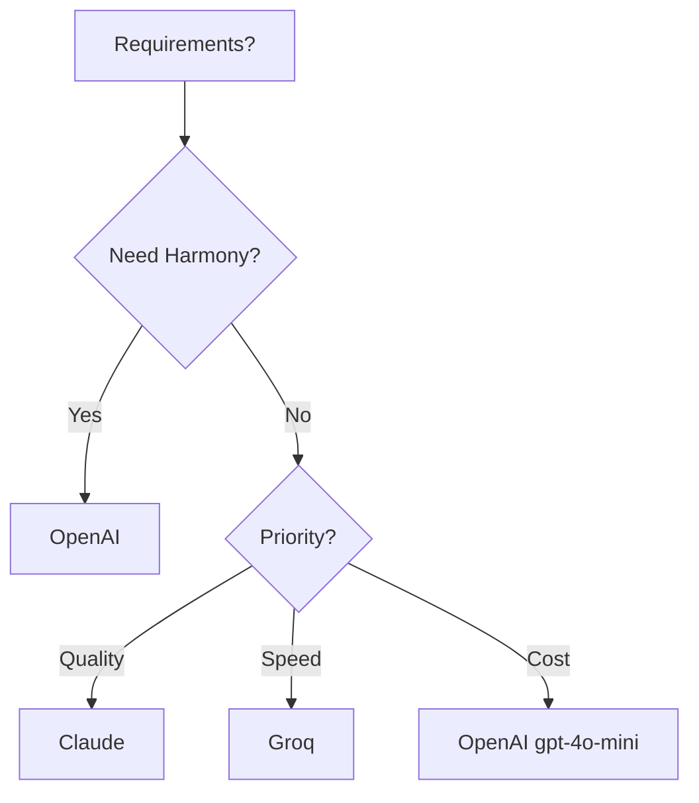

# Providers

Promptel supports multiple LLM providers with a consistent API. Switch providers without changing your prompts.

## Supported Providers

| Provider | Models | Features |
|----------|--------|----------|
| **OpenAI** | GPT-4o, GPT-4, GPT-3.5 | Full support, Harmony Protocol |
| **Anthropic** | Claude 3.5, Claude 3 | Full support |
| **Groq** | Mixtral, LLaMA | Fast inference |

## Configuration

### Environment Variables

```bash
# Set the API key
export PROMPTEL_API_KEY=your-api-key

# Optionally set default provider
export PROMPTEL_PROVIDER=openai
```

### Per-Request Configuration

```javascript
const { executePrompt } = require('promptel');

const result = await executePrompt(prompt, params, {
  provider: 'openai',
  apiKey: 'sk-...'
});
```

## OpenAI

The default provider with full feature support.

### Setup

```bash
export PROMPTEL_API_KEY=sk-your-openai-key
```

### Available Models

| Model | Description | Context |
|-------|-------------|---------|
| `gpt-4o` | Latest multimodal | 128K |
| `gpt-4o-mini` | Fast and affordable | 128K |
| `gpt-4-turbo` | Previous generation | 128K |
| `gpt-3.5-turbo` | Fast, economical | 16K |

### Usage

```javascript
const result = await executePrompt(prompt, params, {
  provider: 'openai'
});
```

### With Specific Model

```javascript
prompt Example {
  constraints {
    model: "gpt-4o"
    maxTokens: 1000
  }
  body {
    text`Your prompt here`
  }
}
```

### Harmony Protocol

OpenAI supports the Harmony Protocol for multi-channel responses:

```javascript
prompt HarmonyExample {
  harmony {
    reasoning: "high"
    channels: ["final", "analysis", "commentary"]
  }
  body {
    text`Analyze this complex problem`
  }
}
```

See [Harmony Protocol Guide](harmony.md) for details.

## Anthropic (Claude)

High-quality responses with strong reasoning.

### Setup

```bash
export PROMPTEL_API_KEY=sk-ant-your-anthropic-key
```

### Available Models

| Model | Description | Context |
|-------|-------------|---------|
| `claude-3-5-sonnet-20241022` | Latest, best balance | 200K |
| `claude-3-opus-20240229` | Most capable | 200K |
| `claude-3-sonnet-20240229` | Balanced | 200K |
| `claude-3-haiku-20240307` | Fast | 200K |

### Usage

```javascript
const result = await executePrompt(prompt, params, {
  provider: 'claude'  // or 'anthropic'
});
```

### With Specific Model

```javascript
prompt ClaudeExample {
  constraints {
    model: "claude-3-5-sonnet-20241022"
    maxTokens: 4096
  }
  body {
    text`Your prompt here`
  }
}
```

## Groq

Ultra-fast inference for supported models.

### Setup

```bash
export PROMPTEL_API_KEY=gsk_your-groq-key
```

### Available Models

| Model | Description | Context |
|-------|-------------|---------|
| `mixtral-8x7b-32768` | Mixtral MoE | 32K |
| `llama-3.1-70b-versatile` | LLaMA 3.1 70B | 128K |
| `llama-3.1-8b-instant` | LLaMA 3.1 8B | 128K |

### Usage

```javascript
const result = await executePrompt(prompt, params, {
  provider: 'groq'
});
```

## Provider Comparison

### Choosing a Provider



### Feature Matrix

| Feature | OpenAI | Claude | Groq |
|---------|--------|--------|------|
| Harmony Protocol | Yes | No | No |
| Streaming | Yes | Yes | Yes |
| Function Calling | Yes | Yes | Yes |
| Vision | Yes | Yes | No |
| Max Context | 128K | 200K | 128K |

## Custom Providers

Extend `ProviderInterface` to add custom providers:

```javascript
const { ProviderInterface } = require('promptel');

class CustomProvider extends ProviderInterface {
  constructor(apiKey) {
    super(apiKey);
    // Initialize your client
  }

  async generateResponse(prompt, constraints) {
    // Implement API call
    const response = await yourApiCall(prompt, constraints);
    return response.text;
  }
}
```

## Error Handling

Handle provider-specific errors:

```javascript
try {
  const result = await executePrompt(prompt, params);
} catch (error) {
  if (error.message.includes('API key')) {
    console.error('Invalid API key');
  } else if (error.message.includes('rate limit')) {
    console.error('Rate limited, retry later');
  } else {
    throw error;
  }
}
```

## Best Practices

1. **Use environment variables** - Never hardcode API keys
2. **Set appropriate models** - Match model to task complexity
3. **Handle errors** - Providers can fail or rate limit
4. **Monitor costs** - Different providers/models have different pricing
5. **Test across providers** - Ensure prompts work everywhere

## Constraints Reference

All providers support these constraints:

| Constraint | Type | Description |
|------------|------|-------------|
| `maxTokens` | number | Maximum response length |
| `temperature` | number | Randomness (0-2) |
| `topP` | number | Nucleus sampling |
| `model` | string | Specific model name |
| `frequencyPenalty` | number | Reduce repetition |
| `presencePenalty` | number | Encourage new topics |

```javascript
constraints {
  maxTokens: 1000
  temperature: 0.7
  topP: 0.9
  model: "gpt-4o"
}
```
