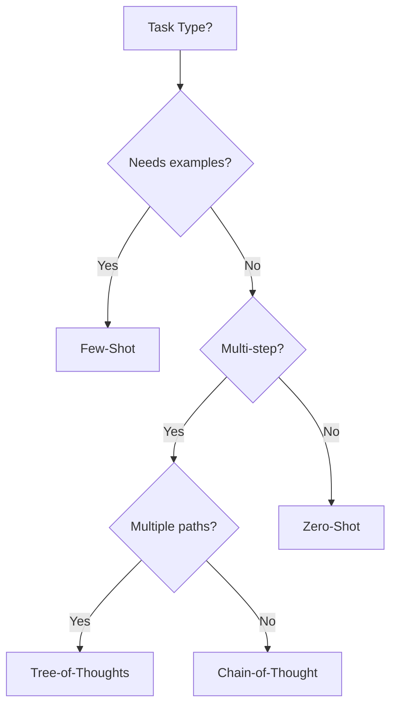

# Prompting Techniques

Promptel provides built-in support for advanced prompting techniques that improve LLM reasoning and output quality.

## Overview

| Technique | Best For | Complexity |
|-----------|----------|------------|
| Chain-of-Thought | Step-by-step reasoning | Low |
| Few-Shot | Learning from examples | Low |
| Zero-Shot | Direct instruction | Low |
| Tree-of-Thoughts | Complex problem solving | Medium |
| ReAct | Action-based reasoning | Medium |
| Self-Consistency | Reliable answers | Medium |

## Chain-of-Thought (CoT)

Break complex problems into explicit reasoning steps.

### .prompt Syntax

```javascript
prompt MathProblem {
  params {
    problem: string
  }

  body {
    text`Solve: ${params.problem}`
  }

  technique {
    chainOfThought {
      step("Understand") {
        text`Read and identify key information`
      }
      step("Plan") {
        text`Determine the approach`
      }
      step("Execute") {
        text`Perform calculations step by step`
      }
      step("Verify") {
        text`Check the answer makes sense`
      }
    }
  }
}
```

### YAML Syntax

```yaml
technique:
  chainOfThought:
    steps:
      - name: Understand
        text: Read and identify key information
      - name: Plan
        text: Determine the approach
      - name: Execute
        text: Perform calculations step by step
      - name: Verify
        text: Check the answer makes sense
```

### When to Use

- Mathematical problems
- Logical reasoning
- Multi-step tasks
- Debugging code
- Analysis tasks

## Few-Shot Learning

Provide examples to guide the model's behavior.

### .prompt Syntax

```javascript
prompt Classifier {
  params {
    text: string
  }

  body {
    text`Classify the sentiment of: ${params.text}`
  }

  technique {
    fewShot {
      example {
        input: "I love this product!"
        output: "positive"
      }
      example {
        input: "Terrible experience, never again."
        output: "negative"
      }
      example {
        input: "It's okay, nothing special."
        output: "neutral"
      }
    }
  }
}
```

### YAML Syntax

```yaml
technique:
  fewShot:
    examples:
      - input: "I love this product!"
        output: "positive"
      - input: "Terrible experience, never again."
        output: "negative"
      - input: "It's okay, nothing special."
        output: "neutral"
```

### When to Use

- Classification tasks
- Format standardization
- Consistent outputs
- Domain-specific behavior

## Zero-Shot

Direct instruction without examples.

### .prompt Syntax

```javascript
prompt Translator {
  params {
    text: string
    targetLang: string
  }

  body {
    text`Translate to ${params.targetLang}: ${params.text}`
  }

  technique {
    zeroShot {
      instruction: "You are a professional translator. Preserve meaning, tone, and cultural nuances."
    }
  }
}
```

### YAML Syntax

```yaml
technique:
  zeroShot:
    instruction: >
      You are a professional translator.
      Preserve meaning, tone, and cultural nuances.
```

### When to Use

- Simple, well-defined tasks
- When examples aren't needed
- Quick prototyping
- General capabilities

## Tree-of-Thoughts (ToT)

Explore multiple solution paths before deciding.

### .prompt Syntax

```javascript
prompt ProblemSolver {
  params {
    problem: string
  }

  body {
    text`Solve: ${params.problem}`
  }

  technique {
    treeOfThoughts {
      branches: 3
      depth: 2
      evaluation: "score"
      thought("Approach A") {
        text`Consider a direct solution`
      }
      thought("Approach B") {
        text`Consider breaking into subproblems`
      }
      thought("Approach C") {
        text`Consider alternative representations`
      }
    }
  }
}
```

### YAML Syntax

```yaml
technique:
  treeOfThoughts:
    branches: 3
    depth: 2
    evaluation: score
    thoughts:
      - name: Approach A
        text: Consider a direct solution
      - name: Approach B
        text: Consider breaking into subproblems
      - name: Approach C
        text: Consider alternative representations
```

### When to Use

- Complex optimization
- Creative problem solving
- When one approach may fail
- Strategic planning

## ReAct (Reasoning + Acting)

Combine reasoning with actions in a loop.

### .prompt Syntax

```javascript
prompt ResearchAgent {
  params {
    question: string
  }

  body {
    text`Research and answer: ${params.question}`
  }

  technique {
    reAct {
      thought {
        text`Reason about what information is needed`
      }
      action {
        text`Decide what action to take`
      }
      observation {
        text`Process the result of the action`
      }
    }
  }
}
```

### YAML Syntax

```yaml
technique:
  reAct:
    thought:
      text: Reason about what information is needed
    action:
      text: Decide what action to take
    observation:
      text: Process the result of the action
```

### When to Use

- Tool-using agents
- Information gathering
- Interactive tasks
- Multi-step workflows

## Self-Consistency

Generate multiple answers and find consensus.

### .prompt Syntax

```javascript
prompt ReliableAnswer {
  params {
    question: string
  }

  body {
    text`Answer: ${params.question}`
  }

  technique {
    selfConsistency {
      samples: 5
      aggregation: "majority"
    }
  }
}
```

### YAML Syntax

```yaml
technique:
  selfConsistency:
    samples: 5
    aggregation: majority
```

### When to Use

- High-stakes answers
- Factual questions
- When consistency matters
- Reducing hallucinations

## Combining Techniques

Techniques can be combined for powerful effects:

```javascript
prompt AdvancedAnalysis {
  params {
    data: string
  }

  body {
    text`Analyze: ${params.data}`
  }

  technique {
    // First, use CoT for structured thinking
    chainOfThought {
      step("Parse") { text`Understand the data` }
      step("Analyze") { text`Find patterns` }
    }

    // Then, ensure consistency
    selfConsistency {
      samples: 3
      aggregation: "majority"
    }
  }
}
```

## Best Practices

### Choosing Techniques



### Tips

1. **Start simple** - Try zero-shot first
2. **Add structure** - Use CoT for complex tasks
3. **Provide examples** - Few-shot improves consistency
4. **Explore options** - ToT for hard problems
5. **Verify results** - Self-consistency for reliability

## Next Steps

- [Harmony Protocol](harmony.md) - Multi-channel reasoning
- [Examples](../examples/advanced.md) - Real-world applications
