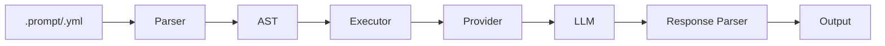

# Promptel

**Declarative prompt engineering for production AI applications.**

Promptel is a framework for writing sophisticated LLM prompts using a clean, declarative syntax. It's the first Node.js framework with native [Harmony Protocol](guides/harmony.md) support for multi-channel reasoning.

---

## Why Promptel?

Modern AI applications need sophisticated prompt engineering, but implementing advanced techniques is complex:

- **Chain-of-Thought** requires careful step management
- **Multi-channel responses** need custom parsing logic
- **Provider switching** means rewriting integration code
- **Prompt maintenance** becomes difficult at scale

Promptel solves these problems with a declarative approach:

```javascript
import { executePrompt } from 'promptel';

const result = await executePrompt(`
prompt MathSolver {
  params {
    problem: string
  }

  body {
    text\`Solve: \${params.problem}\`
  }

  technique {
    chainOfThought {
      step("Analyze") { text\`Break down the problem\` }
      step("Solve") { text\`Calculate step by step\` }
      step("Verify") { text\`Check the answer\` }
    }
  }
}
`, { problem: "What is 25% of 240?" });
```

---

## Key Features

<div class="grid cards" markdown>

-   :material-code-braces:{ .lg .middle } **Dual Format Support**

    ---

    Write prompts in `.prompt` syntax or YAML. Convert between formats seamlessly.

    [:octicons-arrow-right-24: Format Guide](guides/formats.md)

-   :material-brain:{ .lg .middle } **Advanced Techniques**

    ---

    Built-in Chain-of-Thought, Tree-of-Thoughts, ReAct, and more.

    [:octicons-arrow-right-24: Techniques](guides/techniques.md)

-   :material-swap-horizontal:{ .lg .middle } **Multi-Provider**

    ---

    Switch between OpenAI, Anthropic, and Groq with consistent APIs.

    [:octicons-arrow-right-24: Providers](guides/providers.md)

-   :material-music-note:{ .lg .middle } **Harmony Protocol**

    ---

    Native support for multi-channel responses with gpt-oss models.

    [:octicons-arrow-right-24: Harmony](guides/harmony.md)

</div>

---

## Quick Install

```bash
npm install promptel
```

Set your API key:

```bash
export PROMPTEL_API_KEY=your-api-key
```

---

## Quick Example

=== ".prompt format"

    ```javascript
    import { executePrompt } from 'promptel';

    const result = await executePrompt(`
    prompt Greeting {
      params {
        name: string
      }
      body {
        text\`Say hello to \${params.name}\`
      }
    }
    `, { name: "World" });

    console.log(result);
    ```

=== "YAML format"

    ```javascript
    import { executePrompt } from 'promptel';

    const result = await executePrompt(`
    name: Greeting
    params:
      name:
        type: string
        required: true
    body:
      text: "Say hello to \${params.name}"
    `, { name: "World" });

    console.log(result);
    ```

=== "CLI"

    ```bash
    promptel -f greeting.prompt -p openai --params '{"name":"World"}'
    ```

---

## Architecture



---

## Next Steps

- [Installation](getting-started/installation.md) - Get Promptel set up
- [Quick Start](getting-started/quickstart.md) - Build your first prompt
- [Examples](examples/basic.md) - See Promptel in action
